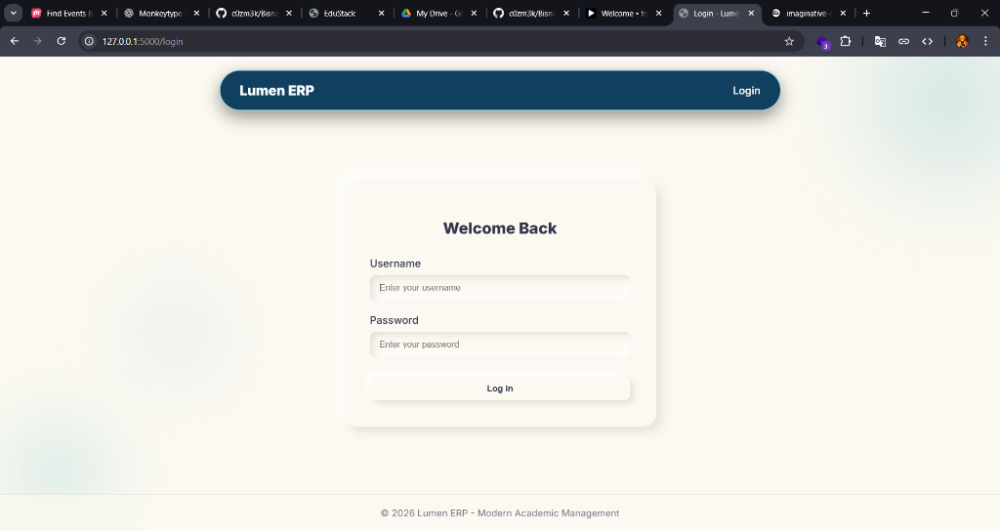
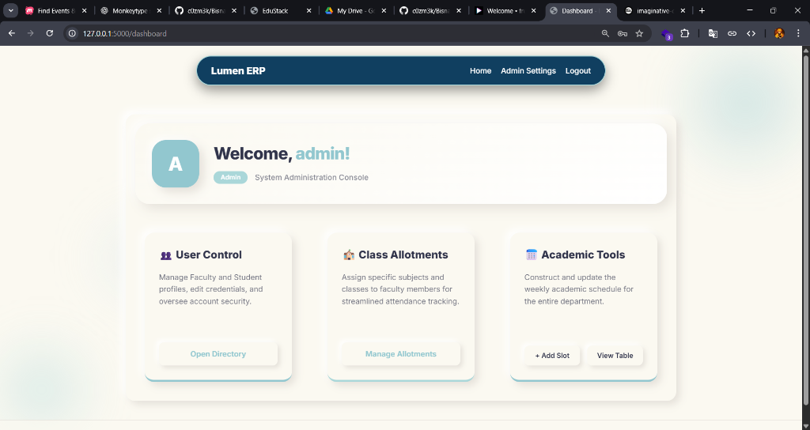

# 🏫 Lumen ERP

> **A modern, soft-UI (Neumorphic) College Management System built with Flask and SQLAlchemy.**

Lumen ERP streamlines college administration by providing a distinct, aesthetic interface for managing attendance, timetables, and academic resources. It features a robust Role-Based Access Control (RBAC) system to ensure secure interactions for Admins, Faculty, and Students.

---

## 📸 Screenshots

*(Add your screenshots here. Since this is a UI-focused project, visuals are important!)*

| Login Page | Dashboard |
| --- | --- |
|  |  |

---

## ✨ Key Features

### 🎨 User Interface

* **Neumorphic Design:** A unified "Soft UI" aesthetic using light and shadow to create depth, providing a modern user experience.
* **Responsive Layout:** Built with clean CSS3 and Jinja2 templates.

### 🔐 Access Control

* **Role-Based Access:** Dedicated portals for **Admin**, **Faculty**, and **Student**.
* **Secure Authentication:** Powered by `Flask-Login` for session management.

### 📚 Modules

* **Attendance Tracking:** Faculty can digitally mark attendance; students can view real-time records.
* **Timetable Management:** Admins create schedules that are visible to all relevant parties.
* **Digital Library:** Faculty can upload study materials (PDF/DOCX); students can download them instantly.

---

## 🛠️ Tech Stack

* **Backend:** Python, Flask, Werkzeug
* **Database:** SQLite (Development), SQLAlchemy (ORM), Flask-Migrate
* **Frontend:** HTML5, CSS3 (Neumorphism), Jinja2 Templating
* **Authentication:** Flask-Login

---

## 🚀 Getting Started

Follow these steps to set up the project locally.

### Prerequisites

* Python 3.8 or higher
* pip (Python Package Installer)

### Installation

1. **Clone the Repository**
```bash
git clone https://github.com/nihadniaze/Lumen-ERP.git
cd Lumen-ERP
```

2. **Set up Virtual Environment**
* *Windows:*
```bash
py -m venv venv
.\venv\Scripts\activate
```

* *macOS / Linux:*
```bash
python3 -m venv venv
source venv/bin/activate
```

3. **Install Dependencies**
```bash
pip install -r requirements.txt
```

4. **Initialize Database**
The app uses SQLite by default. Tables are created automatically on first run. To seed initial data, you can create a seeder script or use the admin panel.

5. **Run the Application**
```bash
python app.py
```

Visit `http://127.0.0.1:5000` in your browser.

---

## 👤 Test Credentials

Use the following accounts to test the different user roles:

| Role | Username | Password | Access Level |
| --- | --- | --- | --- |
| **Admin** | `admin` | `admin123` | Full System Control, User Management, Timetables |
| **Faculty** | `faculty1` | `faculty123` | Attendance Marking, Notes Uploading |
| **Student** | `student1` | `student123` | View Attendance, Download Notes, View Timetable |

---

## 📂 Project Structure

```text
Lumen-ERP/
├── instance/          # SQLite database storage
├── static/
│   ├── css/           # Neumorphic stylesheets
│   └── uploads/       # Storage for notes/documents
├── templates/         # Jinja2 HTML templates
├── app.py             # Application entry point & routes
├── models.py          # SQLAlchemy Database Models
├── config.py          # Configuration settings
└── README.md
```

---

## 🤝 Contributing

Contributions are welcome!

1. Fork the project.
2. Create your feature branch (`git checkout -b feature/AmazingFeature`).
3. Commit your changes (`git commit -m 'Add some AmazingFeature'`).
4. Push to the branch (`git push origin feature/AmazingFeature`).
5. Open a Pull Request.
